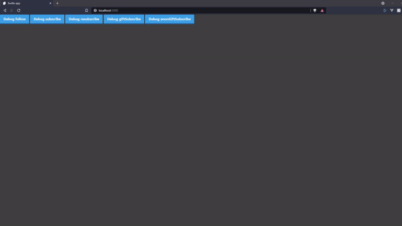

# Twitch stream overlay
This is a custom twitch overlay Which can be used to create custom alerts with svelte and tailwindcss.


## Installation
### Backend
You first need to get the credentials for the backend to talk to twitch. The credentials you need are: 
- CLIENT_ID
- ACCESS_TOKEN
- REFRESH_TOKEN
- CHANNEL_NAME

To get these credentials you could use your own twitch client at https://dev.twitch.tv/ but, if you want a simple way to get these tokens you can use https://twitchtokengenerator.com/ using a custom scoped token. At this time I haven't defined the scope of this project. So I granted all permissions when creating the token. At a later date I'll define the scope of this project.

Once you got the credentials you should provide them into the `backend/.env` file. It should look something like this.
```dotenv
CLIENT_ID="XXXXXXXXXXXXXXXXXXXXXXXXXXXXXX"
ACCESS_TOKEN="XXXXXXXXXXXXXXXXXXXXXXXXXXXXXX"
REFRESH_TOKEN="XXXXXXXXXXXXXXXXXXXXXXXXXXXXXXXXXXXXXXXXXXXXXXXXXX"
CHANNEL_NAME="Your channel name"
LOCAL_WEB_HOOK_PORT="8080" # The port that the frontend listens to
TWITCH_WEB_HOOK_PORT="8081" # The port the backend uses to listen to twitch
```

To build and run the backend run the following commands:
```shell
cd backend
npm install
npm run build:js
node ./lib/index.js
```
### Frontend
To build and run the frontend run the following commands:
```shell
cd frontend
npm install
npm run build
sirv public -s
```

## Running the application
Once you have run the installation once you can start the app in a quicker way. Keep in mind that both apps should be running in order for this overlay to work.
### Backend 
To build and run the backend you can use the start command:
```shell
cd backend
npm start
```
Remember that everytime you make a change the app needs to rerun the start command.

### Frontend
For development purpose with hot reloading run the following commands:
```shell
cd frontend
npm run dev 
```

To run the app in production run the following commands:
```shell
cd frontend
npm run build
npm start
```

## Licence
[GNU General Public License v3.0](Licence)